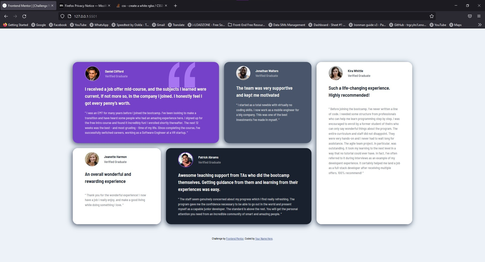

# Frontend Mentor - Testimonials grid section solution

This is a solution to the [Testimonials grid section challenge on Frontend Mentor](https://www.frontendmentor.io/challenges/testimonials-grid-section-Nnw6J7Un7). Frontend Mentor challenges help you improve your coding skills by building realistic projects. 

## Table of contents

- [Overview](#overview)
  - [The challenge](#the-challenge)
  - [Screenshot](#screenshot)
  - [Links](#links)
- [My process](#my-process)
  - [Built with](#built-with)
  - [What I learned](#what-i-learned)
- [Author](#author)
- [Acknowledgments](#acknowledgments)

## Overview

### The challenge

- View the optimal layout for the site depending on their device's screen size

### Screenshot

### Links

- Solution URL: [My Solution](https://github.com/Z-ayat/testimonials-grid-section-main)
- Live Site URL: [My live site](https://z-ayat.github.io/testimonials-grid-section-main/)

## My process

### Built with

- Semantic HTML5 markup
- CSS custom properties
- Flexbox
- CSS Grid

### What I learned

- using grid-area and grid-area-template is much easier to control the grid as constant containers is there

## Author

- Frontend Mentor - [@Z-ayat](https://www.frontendmentor.io/profile/Z-ayat)
- Twitter - [@AliElZayat9](https://twitter.com/AliElZayat9)

## Acknowledgments

-Mr.Osama Elzero the Owener of ElZeroWebSchool YT Channel as his course was great for pure css grid .
